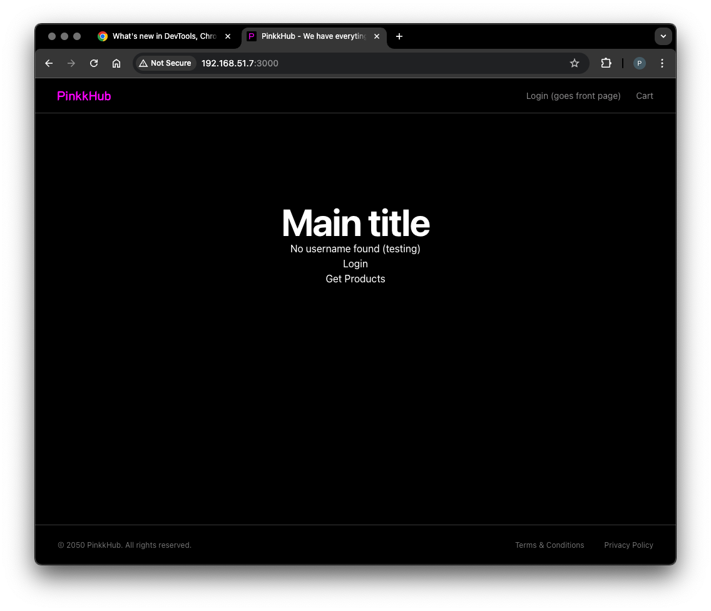

# palvelinten_hallinta-miniprojekti
This is assignment for Palvelinten Hallinta course taught by Tero Karvinen https://terokarvinen.com/palvelinten-hallinta/

## About this project

This project presents Backend for Frontend pattern architecture with Spring Boot and Next.js
using Salt Project for managing code infrastructure.

The backend part of the application is completely automated with Salt,
but the frontend part needs little bit configuration by hand.

The app itself has only login (bff-pattern) and simple GET-request functionalities.



Valitettavasti Googlen OAuth kirjatutumista ei voi tässä käyttää, koska Google Consolin OAuth 2.0 credentiaaleihin kelpaa Authorized redirect URI:ksi vain localhost tai validi domain.

Unfortunately,
Google's OAuth login is not functional in this setup
because Google's OAuth 2.0 credentials require Authorized redict URI to be localhost or valid domain address.  


## How to run (originally made with Apple ARM)

Make sure you have Vagrant installed and run this command.

```
vagrant init bento/debian-12 --box-version 202502.21.0
```

Download and place to the same folder as Vagrantfile.

```
https://packages.broadcom.com/artifactory/api/security/keypair/SaltProjectKey/public
```

```
https://github.com/saltstack/salt-install-guide/releases/latest/download/salt.sources
```

Modify Vagrantfile:

```bash
$minion = <<MINION
sudo apt-get update
mkdir -p /etc/apt/keyrings
cp /vagrant_data/SaltProjectKey.gpg.pub /etc/apt/keyrings/salt-archive-keyring.pgp
cp /vagrant_data/salt.sources /etc/apt/sources.list.d/salt.sources 
sudo apt-get update
sudo apt-get -qy install salt-minion
echo "master: 192.168.51.4">/etc/salt/minion
sudo systemctl restart salt-minion.service
MINION
  
$master = <<MASTER
sudo apt-get update
mkdir -p /etc/apt/keyrings
cp /vagrant_data/SaltProjectKey.gpg.pub /etc/apt/keyrings/salt-archive-keyring.pgp
cp /vagrant_data/salt.sources /etc/apt/sources.list.d/salt.sources  
sudo apt-get update
sudo apt-get -qy install salt-master
sudo systemctl start salt-master.service
MASTER

Vagrant.configure("2") do |config|

  config.vm.box = "bento/debian-12"
  config.vm.box_version = "202502.21.0"

  config.vm.define "master" do |master|
      master.vm.hostname = "master"
      master.vm.network "private_network", ip: "192.168.51.4"
      master.vm.synced_folder ".", "/vagrant_data"
      master.vm.provision :shell, inline: $master
  end

  config.vm.define "resource" do |resource|
      resource.vm.hostname = "resource"
      resource.vm.network "private_network", ip: "192.168.51.5"
      resource.vm.synced_folder ".", "/vagrant_data"
      resource.vm.provision :shell, inline: $minion
  end

  config.vm.define "auth" do |auth|
      auth.vm.hostname = "auth"
      auth.vm.network "private_network", ip: "192.168.51.6"
      auth.vm.synced_folder ".", "/vagrant_data"
      auth.vm.provision :shell, inline: $minion
  end

  config.vm.define "bff" do |bff|
      bff.vm.hostname = "bff"
      bff.vm.network "private_network", ip: "192.168.51.7"
      bff.vm.synced_folder ".", "/vagrant_data"
      bff.vm.provision :shell, inline: $minion
  end

end
```

Then clone this repository https://github.com/pinkkila/shop and switch to 'mini-project' branch.

```
git clone https://github.com/pinkkila/shop.git
```

Then build each Spring project

```
cd resource-server
./gradlew build -x test
```

```
cd authorization-server
./gradlew build -x test
```

```
cd bff
./gradlew build -x test
```

Then copy each .jar (build → libs) file to the same folder where Vagrantfile is. 
Also copy the whole 'shop-front' folder to that same folder.

ssh to the master and run the following commands.

```
vagrant up
```

```
vagrant ssh master
```

```
sudo salt-key -A
```

```
sudo mkdir auth
sudo mkdir bff
sudo mkdir front
sudo mkdir jdk
sudo mkdir postgre
sudo mkdir resource
```

Then in each auth, bff, front and resource make folder named files and run the next commands.

```
sudo cp /vagrant_data/authorization-server-0.0.1-SNAPSHOT.jar /srv/salt/auth/files
sudo cp /vagrant_data/resource-server-0.0.1-SNAPSHOT.jar /srv/salt/resource/files
sudo cp /vagrant_data/bff-0.0.1-SNAPSHOT.jar /srv/salt/bff/files
sudo cp -r /vagrant_data/shop-front /srv/salt/bff/files
```

Then you need to make these init.sls files (use `sudoedit`:

/srv/salt/auth/init.sls

```yaml
/opt/authorization-server/authorization-server-0.0.1-SNAPSHOT.jar:
  file.managed:
    - source: salt://auth/files/authorization-server-0.0.1-SNAPSHOT.jar
    - makedirs: true
    - require:
      - sls: jdk

/etc/systemd/system/authorization-server.service:
  file.managed:
    - contents: |
        [Unit]
        Description=Spring Boot Authorization Server
        After=network.target

        [Service]
        User=root
        ExecStart=/opt/jdk/jdk-21.0.7/bin/java -jar /opt/authorization-server/authorization-server-0.0.1-SNAPSHOT.jar
        SuccessExitStatus=143
        Restart=always
        RestartSec=10

        [Install]
        WantedBy=multi-user.target
    - require:
      - file: /opt/authorization-server/authorization-server-0.0.1-SNAPSHOT.jar

authorization-server.service:
  service.running:
    - enable: True
    - watch:
      - file: /opt/authorization-server/authorization-server-0.0.1-SNAPSHOT.jar
    - require:
      - file: /etc/systemd/system/authorization-server.service
```

/srv/salt/bff/init.sls

```yaml
/opt/bff/bff-0.0.1-SNAPSHOT.jar:
  file.managed:
    - source: salt://bff/files/bff-0.0.1-SNAPSHOT.jar
    - makedirs: true
    - require:
      - sls: jdk

/etc/systemd/system/bff.service:
  file.managed:
    - contents: |
        [Unit]
        Description=Spring Boot Authorization Server
        After=network.target

        [Service]
        User=root
        ExecStart=/opt/jdk/jdk-21.0.7/bin/java -jar /opt/bff/bff-0.0.1-SNAPSHOT.jar
        SuccessExitStatus=143
        Restart=always
        RestartSec=10

        [Install]
        WantedBy=multi-user.target
    - require:
      - file: /opt/bff/bff-0.0.1-SNAPSHOT.jar

bff.service:
  service.running:
    - enable: True
    - watch:
      - file: /opt/bff/bff-0.0.1-SNAPSHOT.jar
    - require:
      - file: /etc/systemd/system/bff.service
```

/srv/salt/front/init.sls

```yaml
nodejs:
  pkg.installed

npm:
  pkg.installed

/home/vagrant/shop-front:
  file.recurse:
    - source: salt://front/files/shop-front
    - makedirs: true
```

/srv/salt/jdk/init.sls

```yaml
/opt/jdk/jdk-21_linux-aarch64_bin.tar.gz:
  file.managed:
    - source: https://download.oracle.com/java/21/latest/jdk-21_linux-aarch64_bin.tar.gz
    - skip_verify: True
    - makedirs: true

unpack-jdk-tar:
  cmd.run:
    - name: tar -xzf /opt/jdk/jdk-21_linux-aarch64_bin.tar.gz -C /opt/jdk
    - creates: /opt/jdk/jdk-21.0.7
    - require:
        - file: /opt/jdk/jdk-21_linux-aarch64_bin.tar.gz

/etc/profile.d/java.sh:
  file.managed:
    - contents: |
        export JAVA_HOME=/opt/jdk/jdk-21.0.7
        export PATH=$JAVA_HOME/bin:$PATH
    - makedirs: true
```

/srv/salt/postgre/init.sls

```yaml
postgresql:
  pkg.installed

myuser:
  postgres_user.present:
    - password: secret
    - encrypted: scram-sha-256
    - require:
        - pkg: postgresql

shop_db:
  postgres_database.present:
    - owner: myuser
    - require:
      - postgres_user: myuser
```

/srv/salt/resource/init.sls

```yaml
/opt/resource-server/resource-server-0.0.1-SNAPSHOT.jar:
  file.managed:
    - source: salt://resource/files/resource-server-0.0.1-SNAPSHOT.jar
    - makedirs: true
    - require:
      - sls: jdk
      - sls: postgre

/etc/systemd/system/resource-server.service:
  file.managed:
    - contents: |
        [Unit]
        Description=Spring Boot Resource Server
        After=network.target

        [Service]
        User=root
        ExecStart=/opt/jdk/jdk-21.0.7/bin/java -jar /opt/resource-server/resource-server-0.0.1-SNAPSHOT.jar
        SuccessExitStatus=143
        Restart=always
        RestartSec=10

        [Install]
        WantedBy=multi-user.target
    - require:
      - file: /opt/resource-server/resource-server-0.0.1-SNAPSHOT.jar

resource-server.service:
  service.running:
    - enable: True
    - watch:
      - file: /opt/resource-server/resource-server-0.0.1-SNAPSHOT.jar
    - require:
      - file: /etc/systemd/system/resource-server.service
```

And finally top file: 

/srv/salt/top.sls
 
```yaml
base:
  'resource':
    - jdk
    - postgre
    - resource
  'auth':
    - jdk
    - auth
  'bff':
    - jdk
    - bff
```

Then run: 

```
sudo salt '*' state.highstate
```

And now starts the part that didn't make till time and requires a little bit of configuration with hands.

Run first

```
sudo salt 'bff' state.apply front
```

Exit from master and ssh to bff.
In the home directory there is 'shop-front' folder.
In that folder, run next commands (you might need to change permissions). 

```
npm i
```

```
npm run build
```

```
npm run start
```

