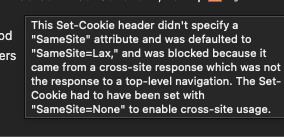
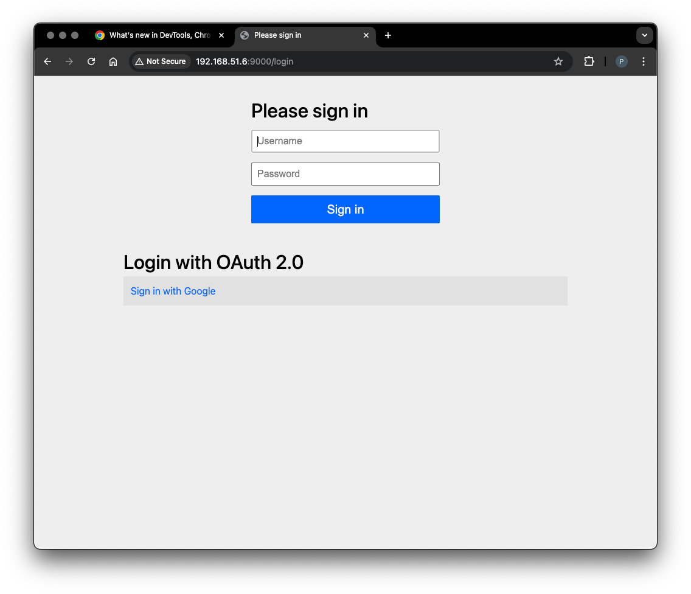
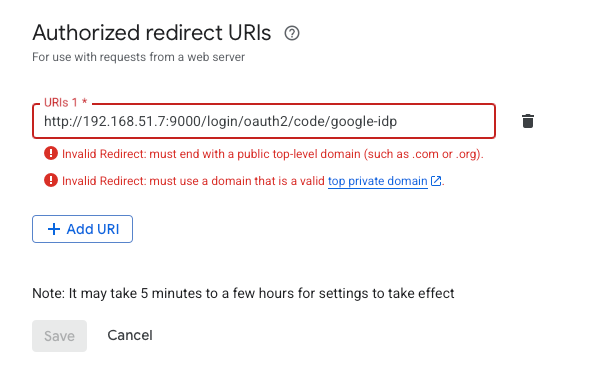

## h5 Miniprojekti

Tehtävät ovat Tero Karvisen opintojaksolta [Palvelinten Hallinta 2025 kevät](https://terokarvinen.com/palvelinten-hallinta/) [^1]

---

#### Laite jolla tehtävät tehdään:

- Apple MacBook Pro M2 Max
- macOS Sequoia 15.3.1
- Parallels Desktop

---

## Projektin tavoite

Valmiin projektin tarkoitus on mallintaa Backend for Frontend patternilla toteutettua sovelluskokonaisuuttaa siten, että koodin infrastruktuuria hallitaan automatisoidusti Salt:lla.

Kokonaisuus tulee sisältämään kolme Sprig Boot sovellusta ja yhden Next.js sovelluksen. Jokainen sovellus tulee olemaan omalla virtuaalikoneellaan ja jokaisella on omat Backend for Frontend patternin mukaiset tehtävät.

Yksittäiset sovellukset ovat:

- Resource Server — Spring Boot
- Authorization Server — Spring Boot
- Backend for Frontend — Spring Boot
- Frontend — Next.js

---

## Vagrantfile

Tein ensin seuraavat Vagrant valmistelut:

- latasin konelle Salt Project asentamiseen tarvittavan public keyn ja salt.sourcen GitHubista:

```
https://packages.broadcom.com/artifactory/api/security/keypair/SaltProjectKey/public
```

```
https://github.com/saltstack/salt-install-guide/releases/latest/download/salt.sources
```

- Loin Vagrantfilen:

```
vagrant init bento/debian-12 --box-version 202502.21.0
```

Aloitin tällä:

```bash
Vagrant.configure("2") do |config|

  config.vm.box = "bento/debian-12"
  config.vm.box_version = "202502.21.0"

  config.vm.define "master" do |master|
      master.vm.hostname = "master"
  end

  config.vm.define "resource" do |resource|
      resource.vm.hostname = "resource"
  end

  config.vm.define "auth" do |auth|
      auth.vm.hostname = "auth"
  end

  config.vm.define "bff" do |bff|
      bff.vm.hostname = "bff"
  end

  config.vm.define "frontend" do |frontend|
      frontend.vm.hostname = "frontend"
  end

end
```

Lopullinen Vagrantfile. Käytin apuna Karvisen ohjetta [^2], Giangin tunnilla esittelemää toteutusta [^3], Paralellin dokumentaatiota [^4] networkingin kanssa ja Vagrantin dokumentaatiota synced folderin kanssa [^5].

```bash
$minion = <<MINION
sudo apt-get update
mkdir -p /etc/apt/keyrings
cp /vagrant_data/SaltProjectKey.gpg.pub /etc/apt/keyrings/salt-archive-keyring.pgp
cp /vagrant_data/salt.sources /etc/apt/sources.list.d/salt.sources 
sudo apt-get update
sudo apt-get -qy install salt-minion
echo "master: 192.168.51.4">/etc/salt/minion
sudo systemctl restart salt-minion.service
MINION
  
$master = <<MASTER
sudo apt-get update
mkdir -p /etc/apt/keyrings
cp /vagrant_data/SaltProjectKey.gpg.pub /etc/apt/keyrings/salt-archive-keyring.pgp
cp /vagrant_data/salt.sources /etc/apt/sources.list.d/salt.sources  
sudo apt-get update
sudo apt-get -qy install salt-master
sudo systemctl start salt-master.service
MASTER

Vagrant.configure("2") do |config|

  config.vm.box = "bento/debian-12"
  config.vm.box_version = "202502.21.0"

  config.vm.define "master" do |master|
      master.vm.hostname = "master"
      master.vm.network "private_network", ip: "192.168.51.4"
      master.vm.synced_folder ".", "/vagrant_data"
      master.vm.provision :shell, inline: $master
  end

  config.vm.define "resource" do |resource|
      resource.vm.hostname = "resource"
      resource.vm.network "private_network", ip: "192.168.51.5"
      resource.vm.synced_folder ".", "/vagrant_data"
      resource.vm.provision :shell, inline: $minion
  end

  config.vm.define "auth" do |auth|
      auth.vm.hostname = "auth"
      auth.vm.network "private_network", ip: "192.168.51.6"
      auth.vm.synced_folder ".", "/vagrant_data"
      auth.vm.provision :shell, inline: $minion
  end

  config.vm.define "bff" do |bff|
      bff.vm.hostname = "bff"
      bff.vm.network "private_network", ip: "192.168.51.7"
      bff.vm.synced_folder ".", "/vagrant_data"
      bff.vm.provision :shell, inline: $minion
  end

  config.vm.define "frontend" do |frontend|
      frontend.vm.hostname = "frontend"
      frontend.vm.network "private_network", ip: "192.168.51.8"
      frontend.vm.synced_folder ".", "/vagrant_data"
      frontend.vm.provision :shell, inline: $minion
  end

end
```

```
vagrant up --provider=parallels
```

Tämän jälkeen masterissa:

```
sudo salt-key -A
```

```bash
vagrant@master:~$ sudo salt-key -A
The following keys are going to be accepted:
Unaccepted Keys:
auth
bff
frontend
resource
Proceed? [n/Y] y
Key for minion auth accepted.
Key for minion bff accepted.
Key for minion frontend accepted.
Key for minion resource accepted.
```

---

## Java 21

Seuraavaksi kaikkiin minioneihin paitsi frontendiin pitäisi asentaa Java 21 ja Debianin package-managerista ei löydy sitä. 

```bash
vagrant@master:~$ apt-cache search openjdk-21-jdk
vagrant@master:~$ apt-cache search openjdk-17-jdk
default-jdk - Standard Java or Java compatible Development Kit
default-jdk-headless - Standard Java or Java compatible Development Kit (headless)
openjdk-17-jdk - OpenJDK Development Kit (JDK)
openjdk-17-jdk-headless - OpenJDK Development Kit (JDK) (headless)
```

```
sudo mkdir -p /srv/salt/jdk
```

```
sudoedit /srv/salt/jdk/init.sls
```

Aiempien asentelujeni peruteella menin Oraclen sivuille [^6] katsomaan miten saisin ladattua jdk-21 Debianiin. Koska käytän ARM konetta valittavaksi jäi tarpallon lataaminen. Latasin ensin jdk:n suoraan toiselle Debianin virutaalikoneelle ja kävin asentamisen sillä läpi. Macissa vaihtelen HOME_JAVA:n jdk:ta .zshr tiedostossa ja saman pystyi tekemään myös Debianin .bashrc tiedostossa, mutta sen ongelmaksi tulee varmaankin se, että HOME_JAVA on user:n muuttuja ja koska salt ajaa kaiken sudo:na ei se ole ehkä toimiva ratkaisu. Kysyin tähän ChatGPT:ltä [^7] vinkkiä ja päädyin vinkin ja tämän Stack Overflow keskustelun [^8] perusteella laittamaan /etc/profile.d/java.sh kansioon konfiguroinnin JAVA_HOME:sta ja PATH:sta. En ehtinyt ihan kunnolla selvittää tuota profide.d hakemisto ja vaikka toisen hyvänoloisen keskustelun [^9], niin en ihan sisäistänyt sitä. Täytyy myöhemmin opiskella tarkemmin. GPT:n [^7] ohjeesta tutkein myös `/opt` hakemistoa ja jos ymmärrän oikein niin ehkä sen käyttö on tässä ok, koska jdk sisältää useita kansioita ja filejä sisällään [^15], mutta en ole kyllä yhtään varma.        

Kun sourcessa on verkko-osoite tarvitsee se Saltin virheilmoituksen mukaan joko tarkistaa hashilla tai sitten skipata. Täytyy myöhemmin tutkia tätäkin, mutta nyt skippasin. 

Käytin Linoden ohjetta Salt:sta ja otin sieltä `makedirs` (tekee puuttuvat kansiot) ja `require` (ei suorita ennen kuin requiren on suoritettu) [^10]. 

`creates` cmd.run statessa aiheuttaa sen, että cmd.run ajetaan vain, jos tiedostoa ei ole olemassa [^11].


```yaml
/opt/jdk/jdk-21_linux-aarch64_bin.tar.gz:
  file.managed:
    - source: https://download.oracle.com/java/21/latest/jdk-21_linux-aarch64_bin.tar.gz
    - skip_verify: True
    - makedirs: true
      
unpack-jdk-tar:
  cmd.run:
    - name: tar -xzf /opt/jdk/jdk-21_linux-aarch64_bin.tar.gz -C /opt/jdk
    - creates: /opt/jdk/jdk-21.0.7
    - require:
        - file: /opt/jdk/jdk-21_linux-aarch64_bin.tar.gz
    
/etc/profile.d/java.sh:
  file.managed:
    - contents: |
        export JAVA_HOME=/opt/jdk/jdk-21.0.7
        export PATH=$JAVA_HOME/bin:$PATH
    - makedirs: true
```

```
sudo salt 'resource' state.apply jdk
```

```bash
vagrant@master:/srv/salt/jdk$ sudo salt 'resource' state.apply jdk
resource:
----------
          ID: /opt/jdk/jdk-21_linux-aarch64_bin.tar.gz
    Function: file.managed
      Result: True
     Comment: File /opt/jdk/jdk-21_linux-aarch64_bin.tar.gz updated
     Started: 17:42:04.733589
    Duration: 3733.008 ms
     Changes:
              ----------
              diff:
                  New file
              mode:
                  0644
----------
          ID: unpack-jdk-tar
    Function: cmd.run
        Name: tar -xzf /opt/jdk/jdk-21_linux-aarch64_bin.tar.gz -C /opt/jdk
      Result: True
     Comment: Command "tar -xzf /opt/jdk/jdk-21_linux-aarch64_bin.tar.gz -C /opt/jdk" run
     Started: 17:42:08.467162
    Duration: 2444.746 ms
     Changes:
              ----------
              pid:
                  2576
              retcode:
                  0
              stderr:
              stdout:
----------
          ID: /etc/profile.d/java.sh
    Function: file.managed
      Result: True
     Comment: File /etc/profile.d/java.sh is in the correct state
     Started: 17:42:10.912038
    Duration: 1.04 ms
     Changes:

Summary for resource
------------
Succeeded: 3 (changed=2)
Failed:    0
------------
Total states run:     3
Total run time:   6.179 s
vagrant@master:/srv/salt/jdk$ sudo salt 'resource' state.apply jdk
resource:
----------
          ID: /opt/jdk/jdk-21_linux-aarch64_bin.tar.gz
    Function: file.managed
      Result: True
     Comment: File /opt/jdk/jdk-21_linux-aarch64_bin.tar.gz is in the correct state
     Started: 17:42:18.072320
    Duration: 185.274 ms
     Changes:
----------
          ID: unpack-jdk-tar
    Function: cmd.run
        Name: tar -xzf /opt/jdk/jdk-21_linux-aarch64_bin.tar.gz -C /opt/jdk
      Result: True
     Comment: /opt/jdk/jdk-21.0.7 exists
     Started: 17:42:18.258009
    Duration: 410.44 ms
     Changes:
----------
          ID: /etc/profile.d/java.sh
    Function: file.managed
      Result: True
     Comment: File /etc/profile.d/java.sh is in the correct state
     Started: 17:42:18.668491
    Duration: 1.196 ms
     Changes:

Summary for resource
------------
Succeeded: 3
Failed:    0
------------
Total states run:     3
Total run time: 596.910 ms
```

Menin vielä varmuuden vuoksi resource-minioniin tarkistamaan:

```bash
vagrant@resource:~$ java --version
java 21.0.7 2025-04-15 LTS
Java(TM) SE Runtime Environment (build 21.0.7+8-LTS-245)
Java HotSpot(TM) 64-Bit Server VM (build 21.0.7+8-LTS-245, mixed mode, sharing)
vagrant@resource:~$ echo $JAVA_HOME
/opt/jdk/jdk-21.0.7
```

Ajoin staten myös auth- ja bff-minineille. 

---

## Postgres

Resource-serverin Spring sovelluksen application.yaml:ssa minulla on yksinkertaisin mahdollinen datasource konfiguraatio:

```yaml
  datasource:
    username: myuser
    password: secret
    url: "jdbc:postgresql://127.0.0.1:5432/shop_db"

  sql:
    init:
      mode: always
```

Asensin ensin Karvisen ohjeilla [^12] Postgresin toiselle Debianin virtuaalikoneelle nähdäkseni hieman mitä tapahtuu. 

Seuraavaksi tein löytämäni ohjeen [^13] perusteella seuraavan init.sls tiedoston /srv/salt/postgre hakemistoon:

Myöhemmin piti lisätä `- encrypted: scram-sha-256` [^14], koska password authentication failed. Tämä tapahtui koska GPT:n [^7] vinkillä katsoin postgren pg_hba.conf tiedostostoon ja se näytti tältä:

```
# Database administrative login by Unix domain socket
local   all             postgres                                peer

# TYPE  DATABASE        USER            ADDRESS                 METHOD

# "local" is for Unix domain socket connections only
local   all             all                                     peer
# IPv4 local connections:
host    all             all             127.0.0.1/32            scram-sha-256
# IPv6 local connections:
host    all             all             ::1/128                 scram-sha-256
# Allow replication connections from localhost, by a user with the
# replication privilege.
local   replication     all                                     peer
host    replication     all             127.0.0.1/32            scram-sha-256
host    replication     all             ::1/128                 scram-sha-256
```

Lisäsin myöhemmin myös `owner` [^13], koska ilman sitä ei ollut oikeutta schemaan.

```yaml
postgresql:
  pkg.installed
          
myuser:
  postgres_user.present:
    - password: secret
    - encrypted: scram-sha-256
    - require:
        - pkg: postgresql
  
shop_db:
  postgres_database.present:
    - owner: myuser
    - require:
      - postgres_user: myuser
```

State näyttäisi toimivan, mutta nähtäväksi jää toimiiko se suoraan Spring sovelluksen kanssa (ei toiminut ilman noita kahta lisäystä (enqrypted ja owner). 

```bash
vagrant@master:/srv/salt/postgre$ sudo salt 'resource' state.apply postgre
resource:
----------
          ID: postgresql
    Function: pkg.installed
      Result: True
     Comment: The following packages were installed/updated: postgresql
     Started: 10:45:47.846704
    Duration: 11910.466 ms
     Changes:
              ----------
              libcommon-sense-perl:
                  ----------
                  new:
                      3.75-3
                  old:
              libjson-perl:
                  ----------
                  new:
                      4.10000-1
                  old:
              libjson-xs-perl:
                  ----------
                  new:
                      4.030-2+b1
                  old:
              libllvm14:
                  ----------
                  new:
                      1:14.0.6-12
                  old:
              libpq5:
                  ----------
                  new:
                      15.12-0+deb12u2
                  old:
              libsensors-config:
                  ----------
                  new:
                      1:3.6.0-7.1
                  old:
              libsensors5:
                  ----------
                  new:
                      1:3.6.0-7.1
                  old:
              libtypes-serialiser-perl:
                  ----------
                  new:
                      1.01-1
                  old:
              libxslt1.1:
                  ----------
                  new:
                      1.1.35-1+deb12u1
                  old:
              libz3-4:
                  ----------
                  new:
                      4.8.12-3.1
                  old:
              postgresql:
                  ----------
                  new:
                      15+248
                  old:
              postgresql-15:
                  ----------
                  new:
                      15.12-0+deb12u2
                  old:
              postgresql-client-15:
                  ----------
                  new:
                      15.12-0+deb12u2
                  old:
              postgresql-client-common:
                  ----------
                  new:
                      248
                  old:
              postgresql-common:
                  ----------
                  new:
                      248
                  old:
              ssl-cert:
                  ----------
                  new:
                      1.1.2
                  old:
              sysstat:
                  ----------
                  new:
                      12.6.1-1
                  old:
----------
          ID: shop_db
    Function: postgres_database.present
      Result: True
     Comment: The database shop_db has been created
     Started: 10:45:59.759190
    Duration: 169.345 ms
     Changes:
              ----------
              shop_db:
                  Present
----------
          ID: myuser
    Function: postgres_user.present
      Result: True
     Comment: The user myuser has been created
     Started: 10:45:59.930539
    Duration: 360.182 ms
     Changes:
              ----------
              myuser:
                  Present

Summary for resource
------------
Succeeded: 3 (changed=3)
Failed:    0
------------
Total states run:     3
Total run time:  12.440 s
vagrant@master:/srv/salt/postgre$ sudo salt 'resource' state.apply postgre
resource:
----------
          ID: postgresql
    Function: pkg.installed
      Result: True
     Comment: All specified packages are already installed
     Started: 10:46:19.407439
    Duration: 8.608 ms
     Changes:
----------
          ID: shop_db
    Function: postgres_database.present
      Result: True
     Comment: Database shop_db is already present
     Started: 10:46:19.416283
    Duration: 132.947 ms
     Changes:
----------
          ID: myuser
    Function: postgres_user.present
      Result: True
     Comment: User myuser is already present
     Started: 10:46:19.550721
    Duration: 144.451 ms
     Changes:

Summary for resource
------------
Succeeded: 3
Failed:    0
------------
Total states run:     3
Total run time: 286.006 ms
```

---

## Spring Boot sovellukset

Muutin resource-serverin application.yaml seuraavaksi:

```yaml
server:
  port: 8090
  address: 192.168.51.5

spring:
  application:
    name: resource-server

  datasource:
    username: myuser
    password: secret
    url: "jdbc:postgresql://127.0.0.1:5432/shop_db"

  sql:
    init:
      mode: always

  security:
    oauth2:
      resourceserver:
        jwt:
          jwk-set-uri: http://192.168.51.6:9000/oauth2/jwks

logging:
  level:
    org.springframework.security: trace
```


Buildasin resource-serverin ja kopioin .jar filen vagrant_data hakemistoon (tähän oli Vagrantifilessä tehty se synced_folder). Sitten sain masterissa kopioitua (vaati sudon):

```
sudo cp /vagrant_data/resource-server-0.0.1-SNAPSHOT.jar /srv/salt/resource/files
```

Nyt olettaisin ainakin, että /opt kansio on oikea paikka pitä .jar tiedostoa, joten päätin käyttää sitä. 

Kun tutkein miten Spring sovellukset tulisi laittaa, löysin Dynamic Technologisin YouTube videon [^16], jonka avulla tein seuraavan filen (virheitä tuli, mutta en laita kaikki tähän, koska tästä tulisi valtan pitkä ja sekava). Laitoin myös Linoden ojeessa [^10] olevan `watch` statementin, joka käynnistää servicen uudelleen, jos .jar tiedosto muuttuu. En tiennyt onko tälläinen itse määritetty service automaattisesti enabled, joten laitoin siihen true. Aika monessa ohjessa näkee tuon enabled olevan lähes poikkeuksetta laitettu serviceiden kanssa, joten oliskohan se hyvä laittaa joka kerta 🤔. Tein myös muille Springeille omat statet.  

```yaml
/opt/resource-server/resource-server-0.0.1-SNAPSHOT.jar:
  file.managed:
    - source: salt://resource/files/resource-server-0.0.1-SNAPSHOT.jar
    - makedirs: true
      
/etc/systemd/system/resource-server.service:
  file.managed:
    - contents: |
        [Unit]
        Description=Spring Boot Resource Server
        After=network.target

        [Service]
        User=root
        ExecStart=/opt/jdk/jdk-21.0.7/bin/java -jar /opt/resource-server/resource-server-0.0.1-SNAPSHOT.jar
        SuccessExitStatus=143
        Restart=always
        RestartSec=10

        [Install]
        WantedBy=multi-user.target
    - require:
      - file: /opt/resource-server/resource-server-0.0.1-SNAPSHOT.jar
        
resource-server.service:
  service.running:
    - enable: True
    - watch:
      - file: /opt/resource-server/resource-server-0.0.1-SNAPSHOT.jar
    - require:
      - file: /etc/systemd/system/resource-server.service
```


```yaml
/opt/authorization-server/authorization-server-0.0.1-SNAPSHOT.jar:
  file.managed:
    - source: salt://auth/files/authorization-server-0.0.1-SNAPSHOT.jar
    - makedirs: true
      
/etc/systemd/system/authorization-server.service:
  file.managed:
    - contents: |
        [Unit]
        Description=Spring Boot Authorization Server
        After=network.target

        [Service]
        User=root
        ExecStart=/opt/jdk/jdk-21.0.7/bin/java -jar /opt/authorization-server/authorization-server-0.0.1-SNAPSHOT.jar
        SuccessExitStatus=143
        Restart=always
        RestartSec=10

        [Install]
        WantedBy=multi-user.target
    - require:
      - file: /opt/authorization-server/authorization-server-0.0.1-SNAPSHOT.jar
        
authorization-server.service:
  service.running:
    - enable: True
    - watch:
      - file: /opt/authorization-server/authorization-server-0.0.1-SNAPSHOT.jar
    - require:
      - file: /etc/systemd/system/authorization-server.service
```

```bash
vagrant@auth:~$ sudo systemctl status authorization-server.service
● authorization-server.service - Spring Boot Authorization Server
     Loaded: loaded (/etc/systemd/system/authorization-server.service; enabled; preset: enabled)
     Active: active (running) since Mon 2025-05-05 15:00:45 CDT; 12min ago
```


```yaml
/opt/bff/bff-0.0.1-SNAPSHOT.jar:
  file.managed:
    - source: salt://bff/files/bff-0.0.1-SNAPSHOT.jar
    - makedirs: true
      
/etc/systemd/system/bff.service:
  file.managed:
    - contents: |
        [Unit]
        Description=Spring Boot Authorization Server
        After=network.target

        [Service]
        User=root
        ExecStart=/opt/jdk/jdk-21.0.7/bin/java -jar /opt/bff/bff-0.0.1-SNAPSHOT.jar
        SuccessExitStatus=143
        Restart=always
        RestartSec=10

        [Install]
        WantedBy=multi-user.target
    - require:
      - file: /opt/bff/bff-0.0.1-SNAPSHOT.jar
        
bff.service:
  service.running:
    - enable: True
    - watch:
      - file: /opt/bff/bff-0.0.1-SNAPSHOT.jar
    - require:
      - file: /etc/systemd/system/bff.service
```

```bash
vagrant@bff:~$ sudo systemctl status bff.service
● bff.service - Spring Boot Authorization Server
     Loaded: loaded (/etc/systemd/system/bff.service; enabled; preset: enabled)
     Active: active (running) since Mon 2025-05-05 15:12:01 CDT; 2min 0s ago
```


---

## Next.js sovellus

Next.js pystyy ajamaan sen omalla serverillä ajamalla `npm run build` ja `npm run start` [^18].

Asentaessani next.js sovellusta minioniin huomasin, että kirjautuminen ei toimi. Auhtuhorization-server kyllä hyväksyy kirjautumisen, mutta koska next.js sovellus on eri osoitteessa, kuin mitä evästeet tarjoava bff Spring Boot sovellus, niin selain ei suostu käsittelemään niitä. Selain ilmoittaa seuraavasti:  



Itselleni tämä on erittäin siisti havainto, koska olen kyllä lukenut tästä, mutta en ole koskaan kunnolla sisäistänyt sitä. Nyt käy myös täysin järkeen miksi esim. tässä ohjeessa [^17] neuvotaan toteuttamaan bff pattern reverse-proxyn kanssa. 

Koska aika alkaa loppua kesken joudun frontendin kanssa tekemään kompromissin ja laitan sen suoraan samaan minioniin bff Spring sovelluksen kanssa. Teen minionissa käsin next.js serverin käynnistämisen. Käytin seuraavaa statea koodin siirtämiseen ja node.js:n ja npm:n asentamiseen. (tämä oli alunperin frontend minionille, todella kätevä ajaa se vain suoraan bff:lle).

`file.recurse` mahdollistaa kansion sisällön kopioimisen [^19].

```yaml
nodejs:
  pkg.installed

npm:
  pkg.installed
  
/home/vagrant/shop-front:
  file.recurse:
    - source: salt://front/files/shop-front
    - makedirs: true

```

Komento, jolla tarkastelin Spring Bootien logeja (esim resource serveristä):

```
sudo journalctl -u resource-server.service -n 300
```




Valitettavasti Googlen OAuth kirjatutumista ei voi tässä käyttää, koska Google Consolin OAuth 2.0 credentiaaleihin kelpaa Authorized redirect URI:ksi vain localhost tai validi domain.




---

## top.sls

Kun itsenäisesti opiskelin Salt:ia törmäsin DevOps Libratyn videoon [^20], jossa tehtiin top.sls tiedosto, jolla sai konfiguroitua ajettavia stateja haluttuihin minioniehin. Videon ohjeilla päätin kokkeilla seuraavaa:

```yaml
base:
  'resource':
    - jdk
    - postgre
    - resource
  'auth':
    - jdk
    - auth
  'bff':
    - jdk
    - bff
```

Tämän jälkeen aloin miettiä järjestystä ja jos ymmärrän oikein, niin Salt dokumentaation [^21] mukaan tässä tulisi käyttää yksittäisissä stateissa `require: - sls: staten nimi`. Omassa setupissani minun ei tarvitse varmistaa muuta kuin, että jdk (ja postgres) asentuu ennen Spring sovelluksia ja että bff-Spring asentuu vasta kun auth-Spring on asentunut. (Totesin myös lopullisesti tässä vaiheessa, että oli erittäin sekava valinta nimetä statet ja minionit samoilla nimillä. Ei mitään järkeä, toki en tainnut nimeämishetkellä ajatellakkaan mitään).

Muutin siis statejen init.sls filet seuraavaksi:

##### resource init.sls

```yaml
/opt/resource-server/resource-server-0.0.1-SNAPSHOT.jar:
  file.managed:
    - source: salt://resource/files/resource-server-0.0.1-SNAPSHOT.jar
    - makedirs: true
    - require:
      - sls: jdk
      - sls: postgre

/etc/systemd/system/resource-server.service:
  file.managed:
    - contents: |
        [Unit]
        Description=Spring Boot Resource Server
        After=network.target

        [Service]
        User=root
        ExecStart=/opt/jdk/jdk-21.0.7/bin/java -jar /opt/resource-server/resource-server-0.0.1-SNAPSHOT.jar
        SuccessExitStatus=143
        Restart=always
        RestartSec=10

        [Install]
        WantedBy=multi-user.target
    - require:
      - file: /opt/resource-server/resource-server-0.0.1-SNAPSHOT.jar

resource-server.service:
  service.running:
    - enable: True
    - watch:
      - file: /opt/resource-server/resource-server-0.0.1-SNAPSHOT.jar
    - require:
      - file: /etc/systemd/system/resource-server.service
```

##### auth init.sls:

```yaml
/opt/authorization-server/authorization-server-0.0.1-SNAPSHOT.jar:
  file.managed:
    - source: salt://auth/files/authorization-server-0.0.1-SNAPSHOT.jar
    - makedirs: true
    - require:
      - sls: jdk

/etc/systemd/system/authorization-server.service:
  file.managed:
    - contents: |
        [Unit]
        Description=Spring Boot Authorization Server
        After=network.target

        [Service]
        User=root
        ExecStart=/opt/jdk/jdk-21.0.7/bin/java -jar /opt/authorization-server/authorization-server-0.0.1-SNAPSHOT.jar
        SuccessExitStatus=143
        Restart=always
        RestartSec=10

        [Install]
        WantedBy=multi-user.target
    - require:
      - file: /opt/authorization-server/authorization-server-0.0.1-SNAPSHOT.jar

authorization-server.service:
  service.running:
    - enable: True
    - watch:
      - file: /opt/authorization-server/authorization-server-0.0.1-SNAPSHOT.jar
    - require:
      - file: /etc/systemd/system/authorization-server.service
```

##### bff init.sls

```yaml
/opt/bff/bff-0.0.1-SNAPSHOT.jar:
  file.managed:
    - source: salt://bff/files/bff-0.0.1-SNAPSHOT.jar
    - makedirs: true
    - require:
      - sls: jdk

/etc/systemd/system/bff.service:
  file.managed:
    - contents: |
        [Unit]
        Description=Spring Boot Authorization Server
        After=network.target

        [Service]
        User=root
        ExecStart=/opt/jdk/jdk-21.0.7/bin/java -jar /opt/bff/bff-0.0.1-SNAPSHOT.jar
        SuccessExitStatus=143
        Restart=always
        RestartSec=10

        [Install]
        WantedBy=multi-user.target
    - require:
      - file: /opt/bff/bff-0.0.1-SNAPSHOT.jar

bff.service:
  service.running:
    - enable: True
    - watch:
      - file: /opt/bff/bff-0.0.1-SNAPSHOT.jar
    - require:
      - file: /etc/systemd/system/bff.service
```

Kosta front state on vajaa, pitää se ajaa tämän ulkopuolella ja vaatii muutenkin säätämistä käsin. Mutta muuten näyttää toimivan (ei-käytössä oleva frontend se tekee errorin):

```
sudo salt '*' state.highstate
```

```bash
vagrant@master:/srv/salt/bff$ sudo salt '*' state.highstate
frontend:
----------
          ID: states
    Function: no.None
      Result: False
     Comment: No Top file or master_tops data matches found. Please see master log for details.
     Changes:

Summary for frontend
------------
Succeeded: 0
Failed:    1
------------
Total states run:     1
Total run time:   0.000 ms
resource:
----------
          ID: /opt/jdk/jdk-21_linux-aarch64_bin.tar.gz
    Function: file.managed
      Result: True
     Comment: File /opt/jdk/jdk-21_linux-aarch64_bin.tar.gz is in the correct state
     Started: 06:57:07.568456
    Duration: 224.694 ms
     Changes:
----------
          ID: unpack-jdk-tar
    Function: cmd.run
        Name: tar -xzf /opt/jdk/jdk-21_linux-aarch64_bin.tar.gz -C /opt/jdk
      Result: True
     Comment: /opt/jdk/jdk-21.0.7 exists
     Started: 06:57:07.793918
    Duration: 469.243 ms
     Changes:
----------
          ID: /etc/profile.d/java.sh
    Function: file.managed
      Result: True
     Comment: File /etc/profile.d/java.sh is in the correct state
     Started: 06:57:08.263217
    Duration: 1.954 ms
     Changes:
----------
          ID: postgresql
    Function: pkg.installed
      Result: True
     Comment: All specified packages are already installed
     Started: 06:57:08.268434
    Duration: 9.705 ms
     Changes:
----------
          ID: myuser
    Function: postgres_user.present
      Result: True
     Comment: User myuser is already present
     Started: 06:57:08.278277
    Duration: 227.727 ms
     Changes:
----------
          ID: shop_db
    Function: postgres_database.present
      Result: True
     Comment: Database shop_db is already present
     Started: 06:57:08.506196
    Duration: 85.48 ms
     Changes:
----------
          ID: /opt/resource-server/resource-server-0.0.1-SNAPSHOT.jar
    Function: file.managed
      Result: True
     Comment: File /opt/resource-server/resource-server-0.0.1-SNAPSHOT.jar is in the correct state
     Started: 06:57:08.591864
    Duration: 69.83 ms
     Changes:
----------
          ID: /etc/systemd/system/resource-server.service
    Function: file.managed
      Result: True
     Comment: File /etc/systemd/system/resource-server.service is in the correct state
     Started: 06:57:08.662085
    Duration: 1.018 ms
     Changes:
----------
          ID: resource-server.service
    Function: service.running
      Result: True
     Comment: The service resource-server.service is already running
     Started: 06:57:08.663284
    Duration: 10.795 ms
     Changes:

Summary for resource
------------
Succeeded: 9
Failed:    0
------------
Total states run:     9
Total run time:   1.100 s
bff:
----------
          ID: /opt/jdk/jdk-21_linux-aarch64_bin.tar.gz
    Function: file.managed
      Result: True
     Comment: File /opt/jdk/jdk-21_linux-aarch64_bin.tar.gz is in the correct state
     Started: 06:57:07.329387
    Duration: 215.914 ms
     Changes:
----------
          ID: unpack-jdk-tar
    Function: cmd.run
        Name: tar -xzf /opt/jdk/jdk-21_linux-aarch64_bin.tar.gz -C /opt/jdk
      Result: True
     Comment: /opt/jdk/jdk-21.0.7 exists
     Started: 06:57:07.545902
    Duration: 667.762 ms
     Changes:
----------
          ID: /etc/profile.d/java.sh
    Function: file.managed
      Result: True
     Comment: File /etc/profile.d/java.sh is in the correct state
     Started: 06:57:08.213715
    Duration: 1.661 ms
     Changes:
----------
          ID: /opt/bff/bff-0.0.1-SNAPSHOT.jar
    Function: file.managed
      Result: True
     Comment: File /opt/bff/bff-0.0.1-SNAPSHOT.jar is in the correct state
     Started: 06:57:08.215452
    Duration: 73.148 ms
     Changes:
----------
          ID: /etc/systemd/system/bff.service
    Function: file.managed
      Result: True
     Comment: File /etc/systemd/system/bff.service is in the correct state
     Started: 06:57:08.288801
    Duration: 1.634 ms
     Changes:
----------
          ID: bff.service
    Function: service.running
      Result: True
     Comment: The service bff.service is already running
     Started: 06:57:08.290583
    Duration: 10.898 ms
     Changes:

Summary for bff
------------
Succeeded: 6
Failed:    0
------------
Total states run:     6
Total run time: 971.017 ms
auth:
----------
          ID: /opt/jdk/jdk-21_linux-aarch64_bin.tar.gz
    Function: file.managed
      Result: True
     Comment: File /opt/jdk/jdk-21_linux-aarch64_bin.tar.gz is in the correct state
     Started: 06:57:07.781817
    Duration: 220.753 ms
     Changes:
----------
          ID: unpack-jdk-tar
    Function: cmd.run
        Name: tar -xzf /opt/jdk/jdk-21_linux-aarch64_bin.tar.gz -C /opt/jdk
      Result: True
     Comment: /opt/jdk/jdk-21.0.7 exists
     Started: 06:57:08.003214
    Duration: 460.274 ms
     Changes:
----------
          ID: /etc/profile.d/java.sh
    Function: file.managed
      Result: True
     Comment: File /etc/profile.d/java.sh is in the correct state
     Started: 06:57:08.463544
    Duration: 1.015 ms
     Changes:
----------
          ID: /opt/authorization-server/authorization-server-0.0.1-SNAPSHOT.jar
    Function: file.managed
      Result: True
     Comment: File /opt/authorization-server/authorization-server-0.0.1-SNAPSHOT.jar is in the correct state
     Started: 06:57:08.464633
    Duration: 49.519 ms
     Changes:
----------
          ID: /etc/systemd/system/authorization-server.service
    Function: file.managed
      Result: True
     Comment: File /etc/systemd/system/authorization-server.service is in the correct state
     Started: 06:57:08.514351
    Duration: 1.536 ms
     Changes:
----------
          ID: authorization-server.service
    Function: service.running
      Result: True
     Comment: The service authorization-server.service is already running
     Started: 06:57:08.516045
    Duration: 10.382 ms
     Changes:

Summary for auth
------------
Succeeded: 6
Failed:    0
------------
Total states run:     6
Total run time: 743.479 ms
ERROR: Minions returned with non-zero exit code
```

--

### Lähteet

[^1]: Tero Karvinen. Palvelinten Hallinta: https://terokarvinen.com/palvelinten-hallinta/ 

[^2]: Tero Karvinen. Salt Vagrant - automatically provision one master and two slaves: https://terokarvinen.com/2023/salt-vagrant/

[^3]: gianglex. H2 - Soitto kotiin: https://github.com/gianglex/Courses/blob/5978adafc55e712df670b3d976f1225698663abb/Palvelinten-Hallinta/h2-soitto-kotiin.md

[^4]: Parallels. Parallels + Vagrant - Private Networks: https://parallels.github.io/vagrant-parallels/docs/networking/private_network.html

[^5]: HashiCorp. Synced Folders - Basic Usage: https://developer.hashicorp.com/vagrant/docs/synced-folders/basic_usage

[^6]: Oracle. 3 Installation of the JDK on Linux Platforms: https://docs.oracle.com/en/java/javase/21/install/installation-jdk-linux-platforms.html#GUID-ADC9C14A-5F51-4C32-802C-9639A947317F

[^7]: OpenAI. ChatGPT: Version 1.2025.112, Model GPT‑4o.

[^8]: Stack Overflow: How can I found where I defined JAVA_HOME: https://stackoverflow.com/questions/43229474/how-can-i-found-where-i-defined-java-home

[^9]: Stack Exchange. What do the scripts in /etc/profile.d do?: https://unix.stackexchange.com/questions/64258/what-do-the-scripts-in-etc-profile-d-do

[^10]: Linode LLC. Configure Apache with Salt Stack: https://www.linode.com/docs/guides/configure-apache-with-salt-stack/

[^11]: Salt Project. SALT.STATES.CMD: https://docs.saltproject.io/en/3006/ref/states/all/salt.states.cmd.html

[^12]: Tero Karvinen. PostgreSQL Install and One Table Database – SQL CRUD tutorial for Ubuntu: https://terokarvinen.com/2016/postgresql-install-and-one-table-database-sql-crud-tutorial-for-ubuntu/

[^13]: Sugeesh. Installing PostgreSQL on an Ubuntu VM Using SaltStack: https://medium.com/@Sugeesh/installing-postgresql-on-an-ubuntu-vm-using-saltstack-4974fd572f2b

[^14]: Salt Project. SALT.STATES.POSTGRES_USER: https://docs.saltproject.io/en/3006/ref/states/all/salt.states.postgres_user.html

[^15]: Fırat Civaner. What does /opt mean in Linux?: https://www.baeldung.com/linux/opt-directory

[^16]: Dynamic Technologies. How To Deploy a Spring Boot Application on a VPS/EC2 Instance: https://www.youtube.com/watch?v=FcblQjgaDXM

[^17]: Jérôme Wacongne. OAuth2 Backend for Frontend With Spring Cloud Gateway: https://www.baeldung.com/spring-cloud-gateway-bff-oauth2

[^18]: Next.js. How to deploy your Next.js application: https://nextjs.org/docs/app/getting-started/deploying#nodejs-server

[^19]: Salt Project. SALT.STATES.FILE: https://docs.saltproject.io/en/3006/ref/states/all/salt.states.file.html

[^20]: DevOpt Library. DevOpsLibrary Episode 4: Salt States: https://www.youtube.com/watch?v=AsvVp-ldT2Q

[^21]: Salt Project. ORDERING STATES: https://docs.saltproject.io/en/3006/ref/states/ordering.html